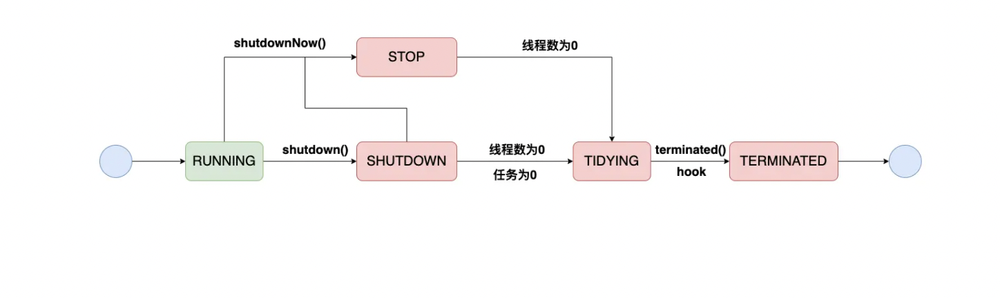

###  ThreadPoolExecutor

#### 内部参数

> ctl：是线程池控制状态位，是一个原子整数，其中包括线程池状态以及线程池运行线程数量（workerCount）

```java
private final AtomicInteger ctl = new AtomicInteger(ctlOf(RUNNING, 0));
```

> 此处说明ctl进行的一种位运算，线程池状态与线程池运行线程数量用或运算连接在一起

```java
private static int ctlOf(int rs, int wc) { return rs | wc; }
```

> 此处说明在ctl中高3位表示线程池状态，剩余29位为线程池运行线程的数量

```java
private static final int COUNT_BITS = Integer.SIZE - 3;
private static final int CAPACITY   = (1 << COUNT_BITS) - 1;

// runState is stored in the high-order bits
private static final int RUNNING    = -1 << COUNT_BITS;
private static final int SHUTDOWN   =  0 << COUNT_BITS;
private static final int STOP       =  1 << COUNT_BITS;
private static final int TIDYING    =  2 << COUNT_BITS;
private static final int TERMINATED =  3 << COUNT_BITS;

// Packing and unpacking ctl
private static int runStateOf(int c)     { return c & ~CAPACITY; }
private static int workerCountOf(int c)  { return c & CAPACITY; }
```

> 线程池状态
>
> RUNNING：运行 （111）
>
> SHUTDOWN：停止向外界获取任务，但是在等待队列中的任务会继续执行，知道全部执行完，关闭线程池  （000）
>
> STOP：强制停止，停止向外界获取任务，同时清除队列中的任务，中断正在进行的任务  （001）
>
> TIDYING：停止所有线程  （010）
>
> TERMINATED：线程池关闭后最后状态



```java
/**放置任务的阻塞队列
	*当workQueue.poll()==null并不意味着workQueue一定为空，可能此处使用的是DelayQueues（等延时时间到才返回非null）
	*/
private final BlockingQueue<Runnable> workQueue;

/**
	*创建新线程的工厂，用于addWorker方法处
	*/
private volatile ThreadFactory threadFactory;

/**
	*拒绝策略，用于线程池满或已经关闭的情况
	*默认直接抛异常
	*private static final RejectedExecutionHandler defaultHandler =new AbortPolicy();
	*/
private volatile RejectedExecutionHandler handler;

/**
	*除去核心线程之外的线程的存活时间
	*/
private volatile long keepAliveTime;

/**
	*如果false，核心线程即使是空闲状态也是活跃状态
	*如果true，核心线程池存活策略按照keepAliveTime
	*此属性非构造器入参
	*/
private volatile boolean allowCoreThreadTimeOut;

/**
	*线程池最大线程数量
	*/
private volatile int maximumPoolSize;

/**
	*线程池中所有工作线程的集合
	*/
private final HashSet<Worker> workers = new HashSet<Worker>();

/**
	*锁定对workers的操作
	*锁定对ctl的操作
	*/
private final ReentrantLock mainLock = new ReentrantLock();

/**
	*完成任务数
	*/
private long completedTaskCount;
```

> 修改线程池的属性（以上面说到的allowCoreThreadTimeOut为例）
>
> （对于allowCoreThreadTimeOut来说，设置为true需要keepAliveTime大于0）
>
> 修改完属性值后，需要执行interruptIdleWorkers()

```java
public void allowCoreThreadTimeOut(boolean value) {
    if (value && keepAliveTime <= 0)
        throw new IllegalArgumentException("Core threads must have nonzero keep alive times");
    if (value != allowCoreThreadTimeOut) {
        allowCoreThreadTimeOut = value;
        if (value)
            interruptIdleWorkers();
    }
}
```

> Worker：线程池中放线程的地方
>
> 继承AQS，实现Runnable
>
> Woker实现简单的锁，用在runWorker中的对worker变量进行设置时保证线程安全
>
> 属性：thread--->线程，firstTask--->要初始化的任务（可能为空），completedTasks--->每个线程的完成任务计数器
>
> 由于继承AQS，Worker中有独占以及释放的方法
>
> 构造器：将AQS的State设为-1（后面runWorker方法解锁，此处禁止中断）

```java
private final class Worker
        extends AbstractQueuedSynchronizer
        implements Runnable
    {
        /**
         * This class will never be serialized, but we provide a
         * serialVersionUID to suppress a javac warning.
         */
        private static final long serialVersionUID = 6138294804551838833L;

        /** Thread this worker is running in.  Null if factory fails. */
        final Thread thread;
        /** Initial task to run.  Possibly null. */
        Runnable firstTask;
        /** Per-thread task counter */
        volatile long completedTasks;

        /**
         * Creates with given first task and thread from ThreadFactory.
         * @param firstTask the first task (null if none)
         */
        Worker(Runnable firstTask) {
            setState(-1); // inhibit interrupts until runWorker
            this.firstTask = firstTask;
            this.thread = getThreadFactory().newThread(this);
        }

        /** Delegates main run loop to outer runWorker  */
        public void run() {
            runWorker(this);
        }

        // Lock methods
        //
        // The value 0 represents the unlocked state.
        // The value 1 represents the locked state.

        protected boolean isHeldExclusively() {
            return getState() != 0;
        }

        protected boolean tryAcquire(int unused) {
            if (compareAndSetState(0, 1)) {
                setExclusiveOwnerThread(Thread.currentThread());
                return true;
            }
            return false;
        }

        protected boolean tryRelease(int unused) {
            setExclusiveOwnerThread(null);
            setState(0);
            return true;
        }

        public void lock()        { acquire(1); }
        public boolean tryLock()  { return tryAcquire(1); }
        public void unlock()      { release(1); }
        public boolean isLocked() { return isHeldExclusively(); }

        void interruptIfStarted() {
            Thread t;
            if (getState() >= 0 && (t = thread) != null && !t.isInterrupted()) {
                try {
                    t.interrupt();
                } catch (SecurityException ignore) {
                }
            }
        }
    }


```


#### 场景流程

###### 创建线程池

> 线程池的创建，构造方法分为一下几种
>
> 1.指定核心池大小，最大线程数，线程存活时间，时间单位，等待队列
>
> 2.指定核心池大小，最大线程数，线程存活时间，时间单位，等待队列，线程工厂
>
> 3.指定核心池大小，最大线程数，线程存活时间，时间单位，等待队列，拒绝策略
>
> 4.指定核心池大小，最大线程数，线程存活时间，时间单位，等待队列，线程工厂，拒绝策略

```java
 public ThreadPoolExecutor(int corePoolSize,
                              int maximumPoolSize,
                              long keepAliveTime,
                              TimeUnit unit,
                              BlockingQueue<Runnable> workQueue) {
        this(corePoolSize, maximumPoolSize, keepAliveTime, unit, workQueue,
             Executors.defaultThreadFactory(), defaultHandler);
    }
    
    
    
public ThreadPoolExecutor(int corePoolSize,
                              int maximumPoolSize,
                              long keepAliveTime,
                              TimeUnit unit,
                              BlockingQueue<Runnable> workQueue,
                              ThreadFactory threadFactory) {
        this(corePoolSize, maximumPoolSize, keepAliveTime, unit, workQueue,
             threadFactory, defaultHandler);
    }    


public ThreadPoolExecutor(int corePoolSize,
                              int maximumPoolSize,
                              long keepAliveTime,
                              TimeUnit unit,
                              BlockingQueue<Runnable> workQueue,
                              RejectedExecutionHandler handler) {
        this(corePoolSize, maximumPoolSize, keepAliveTime, unit, workQueue,
             Executors.defaultThreadFactory(), handler);
    }

public ThreadPoolExecutor(int corePoolSize,
                              int maximumPoolSize,
                              long keepAliveTime,
                              TimeUnit unit,
                              BlockingQueue<Runnable> workQueue,
                              ThreadFactory threadFactory,
                              RejectedExecutionHandler handler) {
        if (corePoolSize < 0 ||
            maximumPoolSize <= 0 ||
            maximumPoolSize < corePoolSize ||
            keepAliveTime < 0)
            throw new IllegalArgumentException();
        if (workQueue == null || threadFactory == null || handler == null)
            throw new NullPointerException();
        this.acc = System.getSecurityManager() == null ?
                null :
                AccessController.getContext();
        this.corePoolSize = corePoolSize;
        this.maximumPoolSize = maximumPoolSize;
        this.workQueue = workQueue;
        this.keepAliveTime = unit.toNanos(keepAliveTime);
        this.threadFactory = threadFactory;
        this.handler = handler;
    }
```


> 同时，JDK提供几种线程池（但阿里规范中不允许使用，此处仅做介绍）

```java
    // 固定线程数量的线程池，无界的队列
    public static ExecutorService newFixedThreadPool(int nThreads) {
        return new ThreadPoolExecutor(nThreads, nThreads,
                                      0L, TimeUnit.MILLISECONDS,
                                      new LinkedBlockingQueue<Runnable>());
    }
    // 单个线程的线程池，无界的队列，按照任务提交的顺序，串行执行    
    public static ExecutorService newSingleThreadExecutor(ThreadFactory threadFactory) {
        return new FinalizableDelegatedExecutorService
            (new ThreadPoolExecutor(1, 1,
                                    0L, TimeUnit.MILLISECONDS,
                                    new LinkedBlockingQueue<Runnable>(),
                                    threadFactory));
    }
    // 动态调节，没有核心线程，全部都是普通线程，每个线程存活60s，使用容量为1的阻塞队列
    public static ExecutorService newCachedThreadPool() {
        return new ThreadPoolExecutor(0, Integer.MAX_VALUE,
                                      60L, TimeUnit.SECONDS,
                                      new SynchronousQueue<Runnable>());
    }
    // 定时任务线程池
    public static ScheduledExecutorService newSingleThreadScheduledExecutor() {
        return new DelegatedScheduledExecutorService
            (new ScheduledThreadPoolExecutor(1));
    }
```

###### 任务执行

> 首先执行ThreadPoolExecutor.execute
>
> 方法中先对任务进行判断，为空，抛空指针异常
>
> 若线程池中线程数小于核心线程数，调用addWorker创建worker
>
> 若线程池中线程数大于核心线程数（或者addWorker失败）
>
> 判断线程池状态是否为RUNNING，是则将任务添加进等待队列
>
> 若线程池状态不为RUNNING或者将任务添加进等待队列失败，则先尝试addWoker，若失败，执行拒绝策略，拒绝任务
>
> ​	进行double-check
>
> ​		若此时线程池状态不为RUNNING，则从等待队列中移除任务，并执行拒绝策略，拒绝任务
>
> ​		若此时线程池状态仍是RUNNING且工作线程数为0，则调用addWorker（此处添加的是一个非核心线程，原因是可能存在创建的线程池核心线程数为0的线程池）

```java
 public void execute(Runnable command) {
        if (command == null)
            throw new NullPointerException();
            int c = ctl.get();
        if (workerCountOf(c) < corePoolSize) {
            if (addWorker(command, true))
                return;
            c = ctl.get();
        }
        if (isRunning(c) && workQueue.offer(command)) {
            int recheck = ctl.get();
            if (! isRunning(recheck) && remove(command))
                reject(command);
            else if (workerCountOf(recheck) == 0)
                addWorker(null, false);
        }
        else if (!addWorker(command, false))
            reject(command);
    }
```

> execute方法中调用addWorker
>
> 入参：任务，add的Worker是核心线程还是非核心线程
>
> 如果线程池状态大于SHUTDOWN，返回null；------1
>
> 当线程池状态为SHUTDOWN时，firstTask不为null（因为SHUTDOWN状态不接受任务）或者等待队列为空，返回null
>
> 当线程池状态小于SHUTDOWN，继续走逻辑
>
> ​	判断当前线程池工作线程数量-------2
>
> ​		如果大于等于CAPACITY，返回null
>
> ​		如果add核心线程Worker，但当前线程池工作线程数量大于核心线程数，返回null
>
> ​		如果add非核心线程Woker，但当前线程池工作线程数量大于最大线程数，返回null
>
> ​	增加ctl的workerCount（CAS），跳出循环
>
> ​	再次校验当前线程池状态，如果和前面的状态不一样，重新从线程池状态开始校验，返回1
>
> ​	如果都不满足，再次循环，返回2
>
> 跳出循环
>
> ​	新建Worker
>
> ​	再次获取当前线程池状态
>
> ​	如果线程池状态小于SHUTDOWN或者（线程池状态为SHUTDOWN并且firstTask==null，因为1处校验，能在此处处于线程池状态为SHUTDOWN且firstTask ==null，其场景为等待队列不为空，即线程池在SHUTDOWN状态下，若等待队列不为空，仍是要addWorker，对应了SHUTDOWN状态下，不接受任务，但已存在任务要执行完）
>
> ​		将worker添加进workers中，更新当前线程池中最大线程数，将workerAdded设为true（这个犹豫操作ThreadPoolExecutor的属性，所以这个操作是在持有mainLock的锁的情况下）
>
> ​	判断workerAdded的值，若为true，代表已添加worker，t.start启动worker的线程，将workerStarted设为true
>
> ​		（其中在Worker构造函数，在填充thread的时，传入的runnable为this，所以t.start会执行Worker的run）
>
> ​	最后判断workerStarted，若为false，执行addWorkerFailed（将workers删除该worker，ctl的workerCount-1），执行tryTerminate方法

```java
private boolean addWorker(Runnable firstTask, boolean core) {
        retry:
        for (;;) {
            int c = ctl.get();
            int rs = runStateOf(c);

            // Check if queue empty only if necessary.
            if (rs >= SHUTDOWN &&
                ! (rs == SHUTDOWN &&
                   firstTask == null &&
                   ! workQueue.isEmpty()))
                return false;

            for (;;) {
                int wc = workerCountOf(c);
                if (wc >= CAPACITY ||
                    wc >= (core ? corePoolSize : maximumPoolSize))
                    return false;
                if (compareAndIncrementWorkerCount(c))
                    break retry;
                c = ctl.get();  // Re-read ctl
                if (runStateOf(c) != rs)
                    continue retry;
                // else CAS failed due to workerCount change; retry inner loop
            }
        }

        boolean workerStarted = false;
        boolean workerAdded = false;
        Worker w = null;
        try {
            w = new Worker(firstTask);
            final Thread t = w.thread;
            if (t != null) {
                final ReentrantLock mainLock = this.mainLock;
                mainLock.lock();
                try {
                    // Recheck while holding lock.
                    // Back out on ThreadFactory failure or if
                    // shut down before lock acquired.
                    int rs = runStateOf(ctl.get());

                    if (rs < SHUTDOWN ||
                        (rs == SHUTDOWN && firstTask == null)) {
                        if (t.isAlive()) // precheck that t is startable
                            throw new IllegalThreadStateException();
                        workers.add(w);
                        int s = workers.size();
                        if (s > largestPoolSize)
                            largestPoolSize = s;
                        workerAdded = true;
                    }
                } finally {
                    mainLock.unlock();
                }
                if (workerAdded) {
                    t.start();
                    workerStarted = true;
                }
            }
        } finally {
            if (! workerStarted)
                addWorkerFailed(w);
        }
        return workerStarted;
    }
```

> Worker的执行交给了外部的方法runWorker（因为Worker实现了Runnable）
>
> 前面的addWorker中有调用t.start()
>
> runWorker方法个人认为是线程池的核心，因为线程池的execute以及shutDown，shutDownNow与本方法均有关联 

```java
final void runWorker(Worker w) {
        Thread wt = Thread.currentThread();
        Runnable task = w.firstTask;
        w.firstTask = null;
  			//此处解锁是因为在Worker的构造方法中进行了setState(-1)
        w.unlock(); // allow interrupts
  			//Woker是否异常死亡（因抛异常而结束）
        boolean completedAbruptly = true;
        try {
          //循环获取task，若Worker未带task，则调用getTask()获取task
          //getTask()后面说明
            while (task != null || (task = getTask()) != null) {
                w.lock();
                // If pool is stopping, ensure thread is interrupted;
                // if not, ensure thread is not interrupted.  This
                // requires a recheck in second case to deal with
                // shutdownNow race while clearing interrupt
              //此处保证，线程池状态为STOP时将线程（若未被设置为中断）设为中断
              //当线程池状态不为STOP时，使用interrupted()，将中断标志位设为false
                if ((runStateAtLeast(ctl.get(), STOP) ||
                     (Thread.interrupted() &&
                      runStateAtLeast(ctl.get(), STOP))) &&
                    !wt.isInterrupted())
                    wt.interrupt();
                try {
                  //执行任务的前置处理
                    beforeExecute(wt, task);
                    Throwable thrown = null;
                    try {
                        task.run();
                    } catch (RuntimeException x) {
                        thrown = x; throw x;
                    } catch (Error x) {
                        thrown = x; throw x;
                    } catch (Throwable x) {
                        thrown = x; throw new Error(x);
                    } finally {
                      	//执行完任务的后置处理
                        afterExecute(task, thrown);
                    }
                } finally {
                    task = null;
                    w.completedTasks++;
                    w.unlock();
                }
            }
          	//没有task，正常销毁
            completedAbruptly = false;
        } finally {
          //调用processWorkerExit销毁Woker
            processWorkerExit(w, completedAbruptly);
        }
    }
```

> Worker的run方法中调用外部的runWorker方法
>
> 在runWorker方法中，Worker循环获取task使用getTask方法
>
> getTask内部也是循环获取任务
>
> （仅在线程池状态为STOP或者状态为SHUTDOWN（且等待队列为空时）返回null，
>
> ​	在销毁线程时，返回null，
>
> ​	在获取到task时，返回task）
>
> getTask方法内可在线程池空闲时进行线程的销毁（直接返回null，跳到processWorkerExit进行销毁线程）

```java
private Runnable getTask() {
        boolean timedOut = false; // Did the last poll() time out?

        for (;;) {
            int c = ctl.get();
            int rs = runStateOf(c);

            // Check if queue empty only if necessary.
          	//对于线程池处于STOP以上状态，getTask返会null
          	//对于线程池处于SHUTDOWN状态（由于SHUTDOWN状态允许线程池中任务完成），所以仅等待队列为空时，返回null
            if (rs >= SHUTDOWN && (rs >= STOP || workQueue.isEmpty())) {
                decrementWorkerCount();
                return null;
            }
						
            int wc = workerCountOf(c);

            // Are workers subject to culling?
          	//是否支持超时机制，为下面的判断销毁线程做准备
            boolean timed = allowCoreThreadTimeOut || wc > corePoolSize;
						//判断销毁线程
          	//如果超过最大线程数，销毁（在调整线程池最大线程数时会出现当前工作线程数大于最大线程数）
          	//如果满足上面的超时机制，经历了超时且线程池中线程数大于1（或者等待队列为空）
          	//第2中情况说明当前线程池比较空闲
            if ((wc > maximumPoolSize || (timed && timedOut))
                && (wc > 1 || workQueue.isEmpty())) {
								//将线程池中的工作线程数减1
                if (compareAndDecrementWorkerCount(c))
                    return null;
                continue;
            }

            try {
              	//如果支持超时机制，那就在存活时间内获取
              	//不支持超时机制，那就阻塞获取
                Runnable r = timed ?
                    workQueue.poll(keepAliveTime, TimeUnit.NANOSECONDS) :
                    workQueue.take();
                if (r != null)
                    return r;
                timedOut = true;
            } catch (InterruptedException retry) {
                timedOut = false;
            }
        }
    }
```

###### 销毁线程

> 先了解interruptIdleWorkers方法（该方法在修改线程池属性时，执行全部worker中断；tryTerminate方法中，使用此方法逐一销毁空闲线程；shutDown以及shutDownNow使用此方法中断工作线程）
>
> interruptIdleWorkers可进行单一中断以及全部中断
>
> interruptIdleWorkers遍历线程池中的所有worker，判断中断标志位，未被中断获取锁，interrupt中断

```java
private void interruptIdleWorkers() {
        interruptIdleWorkers(false);
    }
    
/**
	*中断可能正在等待任务的线程（如未被锁定所示），以便它们可以检查终止或配置更改。 忽略 SecurityExceptions（在这种情况下，某些线程	*可能保持不间断）
	*/
private void interruptIdleWorkers(boolean onlyOne) {
        final ReentrantLock mainLock = this.mainLock;
        mainLock.lock();
        try {
            for (Worker w : workers) {
                Thread t = w.thread;
                if (!t.isInterrupted() && w.tryLock()) {
                    try {
                        t.interrupt();
                    } catch (SecurityException ignore) {
                    } finally {
                        w.unlock();
                    }
                }
                if (onlyOne)
                    break;
            }
        } finally {
            mainLock.unlock();
        }
    }
```


> 在finally中，Woker走到processWorkerExit方法关闭Worker

> 此方法在后半部分，计算了线程池中的最小线程数（保证线程池关闭这个Worker后正常运行）
>
> 首先判断worker是否因异常要被销毁，若是减少ctl的workerCount
>
> 之后将该worker从workers中删除，更新线程池的completedTaskCouint
>
> 执行tryTerminate()
>
> 对于线程池状态小于STOP
>
> ​	若不为异常死亡，计算一下线程池目前的最小线程数，若当前的线程池线程数大于等于这个最小值，就直接return
>
> 最后无论是正常死亡（目前线程数小于线程池的最小值）还是异常死亡，执行addWorker（创建的为非核心线程）

```java
private void processWorkerExit(Worker w, boolean completedAbruptly) {
        if (completedAbruptly) // If abrupt, then workerCount wasn't adjusted
          //此方法仅在Worker异常死亡时调用
          //减少ctl的workerCount
            decrementWorkerCount();

        final ReentrantLock mainLock = this.mainLock;
        mainLock.lock();
        try {
          //统计这个Worker完成的任务数
            completedTaskCount += w.completedTasks;
          //将该Worker从集合中删去
            workers.remove(w);
        } finally {
            mainLock.unlock();
        }
  			//tryTerminate()后面说明
        tryTerminate();
				//如果线程池未关闭
  			//若该Worker为异常结束，执行addWorker添加一个Worker
  			//若Worker为正常结束
  			//计算出线程池中最小的线程数
        int c = ctl.get();
        if (runStateLessThan(c, STOP)) {
            if (!completedAbruptly) {
              //若是允许核心线程也遵循keepAliveTime，则最小线程数为0，否则为核心线程数
                int min = allowCoreThreadTimeOut ? 0 : corePoolSize;
              //若min=0并且等待队列不为空，让min=1，即让线程池中保留一个线程
                if (min == 0 && ! workQueue.isEmpty())
                    min = 1;
              //若此刻线程池中线程数小于min，则执行addWorker添加一个Worker
                if (workerCountOf(c) >= min)
                    return; // replacement not needed
            }
          	//addWorker后面说明
            addWorker(null, false);
        }
    }
```

> 此方法，在worker的processWorkerExit中使用，尝试将线程池变成TERMINATE状态
>
> 如果线程池状态是RUNNING，或者大于等于TIDYING（说明已经经历过这个方法），或者线程池状态为SHUTDOWN且等待队列不为空（因为SHUTDOWN状态还是要队列中的任务完成）
>
> 其中执行interruptIdleWorkers（ONLY_ONRE），中断一个线程，会在getTask阻塞时抛异常，走到processWorkerExit方法进行销毁，再次执行该方法，再中断一个线程（以此来实现空闲线程的销毁）
>
> 将ctl变为TIDYING状态，最后变为TERMINATE状态

```java
final void tryTerminate() {
        for (;;) {
            int c = ctl.get();
          	//如果线程池
            if (isRunning(c) ||
                runStateAtLeast(c, TIDYING) ||
                (runStateOf(c) == SHUTDOWN && ! workQueue.isEmpty()))
                return;
            if (workerCountOf(c) != 0) { // Eligible to terminate
                interruptIdleWorkers(ONLY_ONE);
                return;
            }

            final ReentrantLock mainLock = this.mainLock;
            mainLock.lock();
            try {
                if (ctl.compareAndSet(c, ctlOf(TIDYING, 0))) {
                    try {
                        terminated();
                    } finally {
                        ctl.set(ctlOf(TERMINATED, 0));
                        termination.signalAll();
                    }
                    return;
                }
            } finally {
                mainLock.unlock();
            }
            // else retry on failed CAS
        }
    }
```

###### 关闭线程池

> 使用shutdown()方法关闭线程池
>
> checkShutdownAccess()：判断是否有权限关闭线程池以及中断线程
>
> advanceRunState()：修改线程池状态，如果是在入参状态以上的状态，此方法等价于空方法
>
> interruptIdleWorkers()：中断所有线程
>
> onshutDown()：空方法

```java
public void shutdown() {
        final ReentrantLock mainLock = this.mainLock;
        mainLock.lock();
        try {
            checkShutdownAccess();
            advanceRunState(SHUTDOWN);
            interruptIdleWorkers();
            onShutdown(); // hook for ScheduledThreadPoolExecutor
        } finally {
            mainLock.unlock();
        }
        tryTerminate();
    }
```

> 使用shutDownNow()关闭线程池
>
> 相较于shutdown方法，多了一步tasks=drainQueue();
>
> 这个方法内部就是将等待队列中的任务移入到tasks中，这一步使得等待队列为空，由此在runWorker的getTask会阻塞抛异常
>
> 直接走到销毁线程中，实现线程池中所有线程的销毁
>
> 本方法会返回等待队列中的任务集合

```java
public List<Runnable> shutdownNow() {
        List<Runnable> tasks;
        final ReentrantLock mainLock = this.mainLock;
        mainLock.lock();
        try {
            checkShutdownAccess();
            advanceRunState(STOP);
            interruptWorkers();
            tasks = drainQueue();
        } finally {
            mainLock.unlock();
        }
        tryTerminate();
        return tasks;
    }
```

